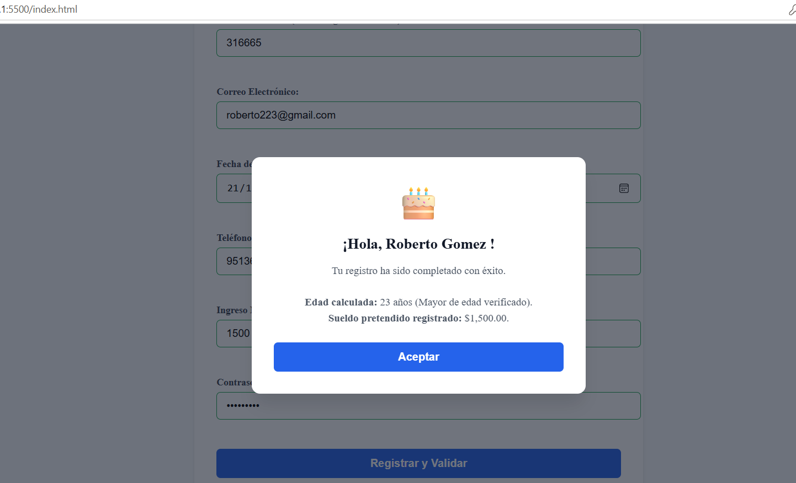

# UtileriaJS — Librería Funcional para Validación y Transformación de Datos

## INSTITUTO TECNOLOÓGICO DE OAXACA 
## GOMEZ VASQUEZ FREDY AZAREL

> **Problema que resuelve:** En el desarrollo de aplicaciones web es frecuente duplicar validaciones de formularios y cálculos de fechas tanto en vistas de registro como en pantallas de autenticación. **UtileriaJS** es una librería ligera (sin frameworks ni componentes visuales) diseñada para centralizar reglas de negocio deterministas: validación estricta de cadenas, verificación de mayorías de edad y formateo de datos listos para el cliente.

---

## Estructura del Repositorio

```text
/utileria
├── README.md             # Documentación, especificaciones y ejemplos
├── index.html            # Formulario de registro con validaciones y modal dinámico
├── login.html            # Pantalla de acceso con validación de credenciales
├── css/
│   └── styles.css        # Estilos visuales del sistema y la ventana modal
├── js/
│   └── utileria.js       # Librería JavaScript pura (sin dependencias UI)
└── img/                  # Capturas de prueba y recursos visuales
```

---

## Instalación

Para utilizar la librería en cualquier archivo HTML, incluye la etiqueta `<script>` apuntando a la ruta de `utileria.js`:

```html
<script src="js/utileria.js"></script>
```

---

## Documentación de Funciones y Ejemplos de Código

### 1. `validarCorreo(correo)`
Valida que la cadena corresponda a una dirección de correo válida mediante una expresión regular estricta.

```javascript
// Retorna boolean
console.log(validarCorreo("usuario@gmail.com")); // true
console.log(validarCorreo("correo_invalido@"));    // false
```

### 2. `soloLetras(texto)`
Comprueba que el texto contenga solo caracteres alfabéticos (mayúsculas, minúsculas, vocales con acento, diéresis y la letra ñ), admitiendo espacios.

```javascript
// Retorna boolean
console.log(soloLetras("Ana María Peña")); // true
console.log(soloLetras("Usuario123"));      // false
```

### 3. `validarLongitud(numero, maxLongitud)`
Evalúa si un valor numérico o cadena de dígitos no excede la cantidad máxima de caracteres permitida.

```javascript
// Retorna boolean
console.log(validarLongitud(12345, 6));   // true
console.log(validarLongitud("1234567", 6)); // false
```

### 4. `calcularEdad(fechaNacimiento)`
Calcula de manera exacta los años cumplidos de una persona tomando en cuenta el día, mes y año actual respecto a la fecha recibida.

```javascript
// Retorna número entero
console.log(calcularEdad("2000-05-15")); // 26 (calculado a la fecha actual)
console.log(calcularEdad("fecha-falsa")); // -1
```

### 5. `esMayorDeEdad(fechaNacimiento)`
Determina si la persona tiene 18 años cumplidos o más según su fecha de nacimiento.

```javascript
// Retorna boolean
console.log(esMayorDeEdad("2003-01-10")); // true
console.log(esMayorDeEdad("2015-08-20")); // false
```

### 6. `validarPassword(password)`
Exige que la contraseña tenga mínimo 8 caracteres, al menos una mayúscula, una minúscula, un dígito numérico y un carácter especial (`!@#$%^&*...`).

```javascript
// Retorna boolean
console.log(validarPassword("Password123!")); // true
console.log(validarPassword("password"));     // false
```

---

## Funciones de la Sección Libre

### 7. `validarTelefonoMX(telefono)`
Verifica que el valor telefónico contenga exactamente 10 dígitos numéricos limpios.

```javascript
// Retorna boolean
console.log(validarTelefonoMX("5512345678"));   // true
console.log(validarTelefonoMX("55-1234-5678")); // true (depura caracteres no numéricos)
console.log(validarTelefonoMX("12345"));        // false
```

### 8. `formatearMoneda(valor, codigoMoneda)`
Convierte cualquier número flotante o entero a notación de moneda local formateada según las convenciones bancarias.

```javascript
// Retorna string formateado
console.log(formatearMoneda(15000, "MXN")); // "$15,000.00 MXN"
console.log(formatearMoneda(249.99, "USD")); // "$249.99 USD"
```

---

## Evidencias de Pruebas en Consola


```markdown


```
